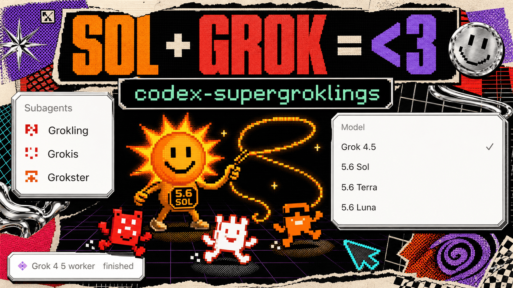
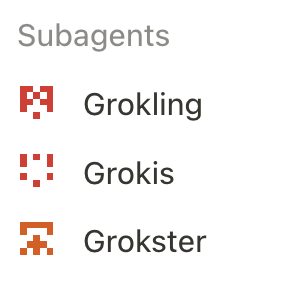
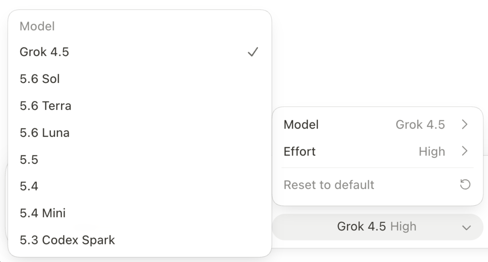

<p align="center">
    
    <h3 align="center">SuperGrok 4.5 in Codex</h3>
    <p align="center">
      Grok 4.5 through a SuperGrok subscription (even as a native Codex subagent) alongside Sol and Terra.
      <br>
      <p align="center">
        
        
        <a href="https://github.com/e-simpson/codex-supergroklings"></a>
        <br/>
        <a href="https://supergrok.com/"></a>
      </p>
    </p>
</p>

## Install (paste into Codex)

```text
Install the setup-codex-grok-supergrok skill globally, then use it to run the One-Session Core Install:

`bunx skills add e-simpson/codex-supergroklings --skill setup-codex-grok-supergrok --agent codex --global --yes`

Prefer bunx (but npx also works). If you don't have Bun, replace `bunx` with `npx`.

Then use $setup-codex-grok-supergrok to install Grok 4.5 in standard mode. Guide me through browser authorization if needed, run its verification checks, and tell me when I need to restart Codex.

Unless otherwise specified, make Codex choose Grok automatically for eligible bounded work and run the installer with `CODEX_GROK_SUBAGENTS_MODE=aggressive`.
```

## Screenshots

<p align="center">
  
  <br/>
  <em>Grok 4.5 available as a selectable Codex model</em>
</p>

<p align="center">
  
  <br/>
  <em>Codex Desktop running SuperGrok Grok 4.5 as the root model</em>
</p>

## Manual Installation

```shell
bunx skills add e-simpson/codex-supergroklings --skill setup-codex-grok-supergrok --agent codex --global --yes
```

## Requirements

- macOS, Codex Desktop and CLI, and Bun or Node.js with `npx`.
- An active SuperGrok or eligible X Premium+ subscription.
- A browser for xAI device authorization; no xAI API key is required.

## How

The installer creates local OAuth and provider files under `~/.codex`, a loopback-only adapter on `127.0.0.1:48145`, a Grok role, and a companion skill. It does **not** install Codex or Bun, buy a subscription, or patch the Desktop app by default.

Restart Codex after installation, then use a new Sol or Terra task. Standard mode keeps `$grok-subagents` explicit; aggressive mode allows Codex to invoke it when appropriate.

## Why

- Grok 4.5 is very good and efficient
- Sol is very very smart and good at delegating
- **Uses your SuperGrok subscription** instead of wiring an API key into every Codex workflow.

## How it works

1. **Hermes-inspired OAuth.** The device-code flow was studied from [Hermes Agent](https://github.com/NousResearch/hermes-agent)'s open-source xAI OAuth implementation. A Bun helper authorizes in the browser, stores credentials with restricted permissions, refreshes access tokens, and supplies bearer tokens to Codex without logging them.
2. **Local adapter.** A lightweight server bound only to `127.0.0.1:48145` forwards Responses requests to xAI, removes Codex fields xAI does not support, and normalizes incompatible tool output into xAI-compatible input.
3. **Native provider and role.** The installer registers `xai-grok-oauth`, a `grok` CLI profile, a Grok 4.5 model catalog entry, and the high-reasoning `grok_4_5_subagent` role. It deliberately avoids a global `model_provider` override, which can break normal ChatGPT-backed tasks.
4. **Multi-Agent V1 compatibility path.** Sol and Terra delegate to Grok through Codex’s native V1 subagent protocol. V2 encrypts the delegated task for OpenAI’s own provider path, which an external xAI child cannot decrypt; see [Codex issue #31814](https://github.com/openai/codex/issues/31814).

The normal subagent flow does not modify the Codex app. Directly selecting Grok as the root model in Desktop is a separate unsupported option: the bundled setup skill has a guarded, backup-first patcher that changes only Grok’s new-task provider route and preserves normal OpenAI tasks.

## Use it (if not in aggressive mode)

Ask Codex: “Use `$grok-subagents` to review this change for bugs, security issues, and missing tests.” The root should fan out only genuinely independent work, reconcile the results, and surface xAI OAuth, entitlement, or rate-limit failures rather than silently switching models.

## License

MIT — see [LICENSE](LICENSE) and [NOTICE](NOTICE). This is an independent, unofficial integration; it is not affiliated with or supported by OpenAI, Codex, ChatGPT, xAI, or Nous Research.
